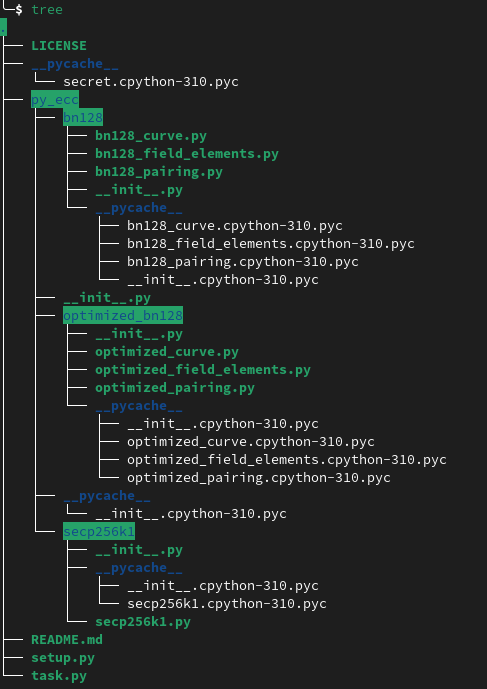
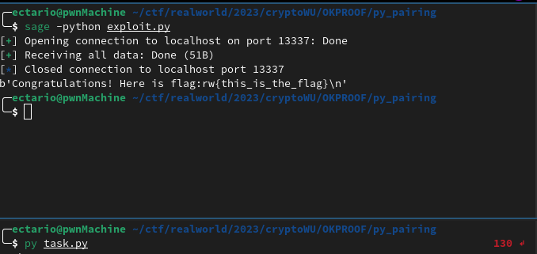

# Write-Up for the cryptanalysis challenge from the RealWorld (2023)

## Context

### What's the RealWorld CTF?

"All challenges are built on the top of real world applications. Hack the Real. Super Hunters Conquer Together." - Their site

Most of the time the challenges are based on 0days to find or 1-days in more or less known github projects.

### Why not the 2024?

In cryptography, RealWorld is not the highest bidder, in general there is only 1 challenge, this year the difficulty was noted as the simplest. Short and not detailed summary of the challenge in the appendices at the end.

As this year's is not the most interesting (from my personal point of view and in terms of cryptanalysis), I prefer to explain the one that I solved while I was training for RealWorld 2024 and which dates from last year. (by the way, for those interested, there is a great github which archives almost, or maybe even all, the CTFs: https://github.com/sajjadium/ctf-archives)

------

### The challenge

**Source:** https://github.com/sajjadium/ctf-archives/tree/main/ctfs/RealWorld/2023/crypto/OKPROOF

**Prerequisites:** basic knowledge of algebra \
**Keywords:** Zero-Knowledge Proof, Elliptic Curve, Linear Combination, Algebra, Cryptanalysis\
**Difficulty:** Normal

--- 

### Recon

First of all, let's look at the files we have:



The setup file is quite interesting, it gives us the dependencies and their source, and in particular https://github.com/ethereum/py_pairing which is the repository where `py_ecc` comes from.

Now, let's look at the file (which a priori given its name) seems to be the main file of the challenge: `task.py`

The main part of the code:

```py
def handle(self):
    try:
        signal.signal(signal.SIGALRM, self.timeout_handler)
        self.dosend('===========================')
        self.dosend('=WELCOME TO 0KPR00F SYSTEM=')
        self.dosend('===========================')
        PK,VK = genK(curve_order)
        self.dosend(str(PK))
        self.dosend('now give me your proof')
        msg = self.request.recv(1024).strip()
        msg = msg.decode('utf-8')
        tmp = msg.replace('(','').replace(')','').replace(',','')
        tmp = tmp.split(' ')
        assert len(tmp) == 6
        PiC = (FQ(int(tmp[0].strip())),FQ(int(tmp[1].strip())))
        PiCa = (FQ(int(tmp[2].strip())),FQ(int(tmp[3].strip())))
        PiH = (FQ(int(tmp[4].strip())),FQ(int(tmp[5].strip())))
        proof = (PiC,PiCa,PiH)
        if self.OKPROOF(proof,VK):
            self.dosend("Congratulations! Here is flag:"+flag)
        else:
            self.dosend("sorry")
```

The logic seems quite simple, the server generates a public key and a private key. Then it sends us the public key and asks us for 3 points with coordinates (x,y) in FQ (fields that we know because it comes from py_ecc) and which must allow the OKPROOF function to return True.

So, let's go deeper and look at the OKPROOF function:

```py
def OKPROOF(self,proof,VK):
    return verify(proof,VK)
```

`verify` function:

```py
def verify(proof,VK):
    VKa,VKz = VK
    PiC,PiCa,PiH = proof

    l = pairing(VKa, PiC)
    r = pairing(G2, PiCa)
    if l != r:
        return False
    l = pairing(G2,PiC)
    r = pairing(VKz,PiH)
    if l != r:
        return False
    return True
```

The `pairing` function is defined in `py_ecc`, and it is a function for pairing points (ate pairing) on an elliptic curve, (to go [further](https://eprint.iacr.org/2007/247.pdf) and also [this](https://medium.com/@VitalikButerin/exploring-elliptic-curve-pairings-c73c1864e627)), that is to say to simplify a bilinear function which allows us to do, for example, this kind of verification: 

----

Let $P, G, R$ be points over an elliptic curve named $E(\mathbb{F}_p)$. \
Let $p, q, r$ be values from a Finite Field named $\mathbb{F}_p$. 

$$
P = G \cdot p
$$
$$
Q = G \cdot q
$$
$$
R = G \cdot r
$$

Using the pairing function, we can verify that $p \cdot q = r$ by checking if $\text{pairing}(P, Q) = R$.

----

Okey, so our points that we give must satisfy the `verify` pairings.

Well let's look at what information we have with `PK` (the public key which is given).

in `genK`:

```py
def genK(curve_order,length=LENGTH):
    t = int(os.urandom(8).hex(),16) % curve_order
    a = int(os.urandom(8).hex(),16) % curve_order
    Ct = Cx(t)
    PKC = []
    for ct in Ct:
        PKC.append(multiply(G1, ct))
    PKCa = []
    for ct in Ct:
        PKCa.append(multiply(multiply(G1, ct), a))

    PK = (PKC,PKCa)
    VKa = multiply(G2, a)
    VKz = multiply(G2, Z(t))
    VK = (VKa,VKz)
    return PK,VK
```

in `Cx`:


```py
def Cx(x,length=LENGTH):
    res = []
    for i in range(length):
        res.append(pow(x,i,curve_order) % curve_order)
    return res

```

in `Z`:

```py
def Z(x):
    return (x-1)*(x-2)*(x-3)*(x-4) % curve_order
```

So `PK` is formed as `(PKC, PKCa)`. And since `LENGTH = 7` from the constants declared in the beginning of `task.py`:

$$
PKC = [G_1, t \cdot G_1, t^2 \cdot G_1, t^3 \cdot G_1, t^4 \cdot G_1, t^5 \cdot G_1, t^6 \cdot G_1]
$$
$$
PKCa = [a \cdot G_1, a \cdot t \cdot G_1, a \cdot t^2 \cdot G_1, a \cdot t^3 \cdot G_1, a \cdot t^4 \cdot G_1, a \cdot t^5 \cdot G_1, a \cdot t^6 \cdot G_1]
$$

Also `VK` is formed as `(VKa, VKz)`. And:

    VKa = a * G2
    VKz = (t-1)*(t-2)*(t-3)*(t-4) * G2

### Summary of known information

Unknown:

- `a` is random
- `t` is random
- `VK` structured as explained above

Known:

- `PK` structured as explained above
- `G1`, `G2`, the elliptic curve and the finite field we are working on (defined in `py_ecc`)

Controlled:

- `PiC`
- `PiCa`
- `PiH`

### Analyse

So let's remember, the goal is that the `verify` function must return True. And so let these statements be true:

```py
pairing(VKa, PiC) == pairing(G2, PiCa)
pairing(G2,PiC) == pairing(VKz,PiH)
```

A quick reminder of a very interesting property of bilinearity:

Let $F$ be the bilinear mapping: $\mathbb{R}^2 \to \mathbb{R}$, and let $A, B, \mu \in \mathbb{R}$. Then, 

$$
F(A, \mu \cdot B) = F(\mu \cdot A, B) = \mu \cdot F(A, B).
$$

So using this property:

```py
"""These pairings"""

pairing(VKa, PiC) == pairing(G2, PiCa)
pairing(G2,PiC) == pairing(VKz,PiH)

"""Become"""

pairing(G2, a * PiC) == pairing(G2, PiCa)                           # because VKa == a * G2
pairing(G2, PiC) == pairing(G2, (t-1)*(t-2)*(t-3)*(t-4) * PiH)      # because VKz = (t-1)*(t-2)*(t-3)*(t-4) * G2
```

So we need to find `PiC` such that `PiC == (t-1)*(t-2)*(t-3)*(t-4) * PiH` and `a * PiC == PiCa`

Let us observe that if `PiH = G1` then:

$$
\Rightarrow \quad PiC = (t-1)(t-2)(t-3)(t-4) \cdot G_1
$$
$$
\Rightarrow \quad PiC = (t^4 - 10t^3 + 35t^2 - 50t + 24) \cdot G_1
$$
$$
\Rightarrow \quad PiC = t^4 \cdot G_1 - 10t^3 \cdot G_1 + 35t^2 \cdot G_1 - 50t \cdot G_1 + 24 \cdot G_1
$$ 

Second arrow obtained by developping:

$$
(t-1)(t-2)(t-3)(t-4) = t^4 - 10t^3 + 35t^2 - 50t + 24
$$

Except that we now recall that we know `PKC` and that it is 

$$
[G_1, t \cdot G_1, t^2 \cdot G_1, t^3 \cdot G_1, t^4 \cdot G_1, t^5 \cdot G_1, t^6 \cdot G_1]
$$

We therefore have that `PiC` is simply a linear combination of `PKC`:

$$
PiC = PKC[4] - 10 \cdot PKC[3] + 35 \cdot PKC[2] - 50 \cdot PKC[1] + 24 \cdot PKC[0]
$$

Now that we have obtained a value for `PiC` and `PiH` we need `PiCa`. \
We know that `PiCa` must be equal to `a * PiC` so:

$$
\Rightarrow \quad a \cdot PiC = a \cdot (t-1)(t-2)(t-3)(t-4) \cdot G_1
$$
$$
\Rightarrow \quad a \cdot PiC = a \cdot (t^4 - 10t^3 + 35t^2 - 50t + 24) \cdot G_1
$$
$$
\Rightarrow \quad a \cdot PiC = a \cdot t^4 \cdot G_1 - a \cdot 10t^3 \cdot G_1 + a \cdot 35t^2 \cdot G_1 - a \cdot 50t \cdot G_1 + a \cdot 24 \cdot G_1
$$

Eureka! It's a linear combination of `PKCa`!

$$
a \cdot PiC = PKCa[4] - 10 \cdot PKCa[3] + 35 \cdot PKCa[2] - 50 \cdot PKCa[1] + 24 \cdot PKCa[0]
$$

So we clearly have our goal `PiC == (t-1)*(t-2)*(t-3)*(t-4) * PiH` and `a * PiC == PiCa`

Let's code our exploit.

### Exploit

```py
from pwn import *
from sage.all import *

proc = remote("localhost", 13337)

# Values from the py_ecc library
p = 21888242871839275222246405745257275088696311157297823662689037894645226208583
E = EllipticCurve(GF(p), [0, 3])
G1 = E(1, 2)

proc.recvlines(3)

PK = proc.recvline()
PK = eval(PK)

PKC = list(map(lambda coordinates: E(coordinates[0],coordinates[1]), PK[0]))
PKCa = list(map(lambda coordinates: E(coordinates[0],coordinates[1]), PK[1]))

t = var('t')
ring = PolynomialRing(ZZ, t)
poly = ring((t-1)*(t-2)*(t-3)*(t-4))
coeffs = [*poly]

assert poly.degree() <= len(PKC) and  len(PKC) == len(PKCa)

PiH = G1
#'t' below is the random t from the genK method server side
# PiC = 24 * G1 - 50 * t * G1 + 35 * t^2 * G1 - 10 * t^3 * G1 + t^4 * G1
# PiC = 24 * PKC[0] - 50 * PKC[1] + 35 * PKC[2] - 10 * PKC[3] + PKC[4]
PiC = sum([PKC[i]*coeffs[i] for i in range(len(coeffs))])
# 't' and 'a' below are the random 't' and 'a' from the genK method server side
# PiCa = 24 * a * G1 - 50 * a * t * G1 + 35 * a * t^2 * G1 - 10 * a * t^3 * G1 + a * t^4 * G1
# PiCa = 24 * PKCa[0] - 50 * PKCa[1] + 35 * PKCa[2] - 10 * PKCa[3] + PKCa[4]
PiCa = sum([PKCa[i]*coeffs[i] for i in range(len(coeffs))])

# Sending the coordinates of PiC, PiCa and PiH to server
payload = ' '.join([str(coord) for xy in [PiC.xy(), PiCa.xy(), PiH.xy()] for coord in xy])

proc.recvline()
proc.sendline(payload.encode())

print(proc.recvall(30))
```



## Appendices

### Challenge 2024 lil' write-up

Big Up to the team I was with for the CTF: MadeInFrance

Provided attachments: An encrypted zip and a PCAP.

This was a vulnerability in the project https://github.com/gwuhaolin/lightsocks. The project uses monoalphabetic substitution encryption, which implies a lack of diffusion and known plaintext attacks are possible. The challenge therefore consisted of exploiting this vulnerability which allowed us to obtain the cleartext of an encrypted file in the PCAP which was given to us. After which we had to exploit the fact that the file that we were able to decrypt was in the encrypted zip that we were also given. The zip being encrypted with ZipCrypto (instead of AES) it is therefore possible to modify the internal encryption keys (see https://github.com/kimci86/bkcrack) thanks to the previous step (because we know the cleartext of one of the encrypted files). After that we can unzip and recover another encrypted file for which we have the key (because the first step gives us a text where there is a key in hexadecimal). Nice! The flag appears.
